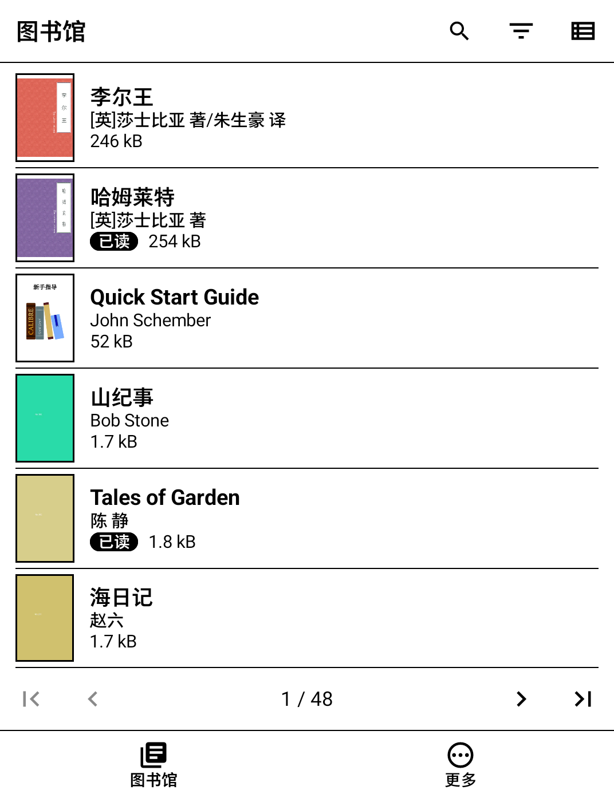
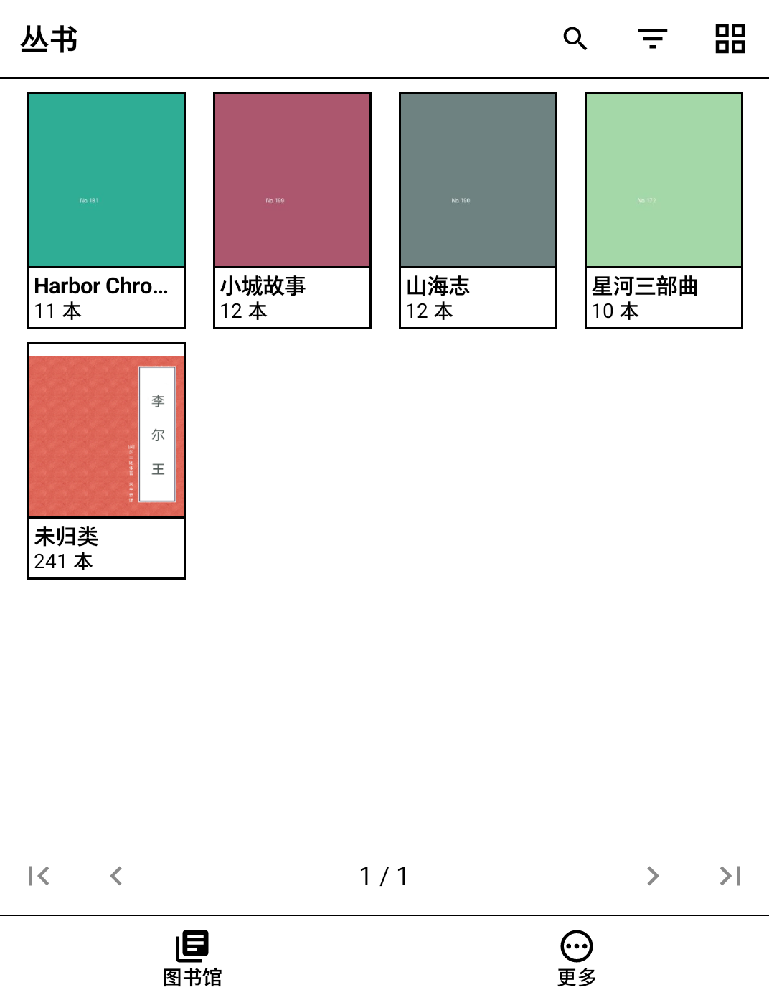
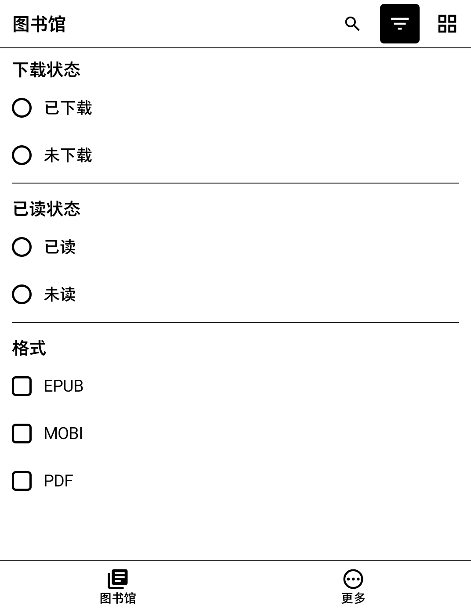
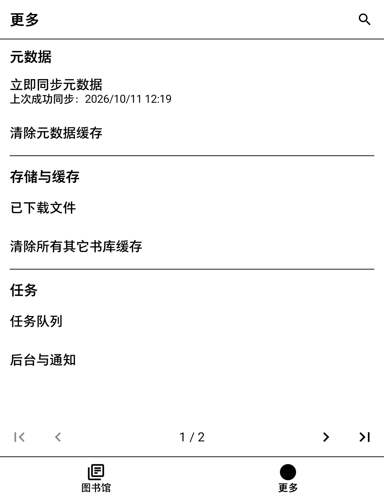
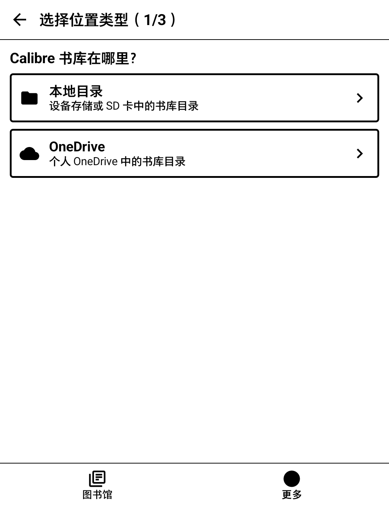

# Calibre Cloud

**把整个 Calibre 书库装进你的墨水屏阅读器。**

Calibre Cloud 是一款为墨水屏设备打造的 Android 书库应用。它直接读取你放在设备存储、SD 卡或个人 OneDrive 里的 Calibre 书库，让你像在电脑上一样浏览、搜索和筛选全部藏书。只需轻点一本书，它就会下载下来，交给你喜欢的阅读器打开。

    
    
    

[**⬇ 从 GitHub Release 下载最新版本**](https://github.com/chenxiex/calibre-cloud/releases/latest)

## 为什么选择 Calibre Cloud

- **为墨水屏而生**：黑白高对比界面，简洁无动画，用分页代替滚动，适合墨水屏刷新。
- **书库原样即用**：无需架设服务器，也无需转换格式。只要选中含有 `metadata.db` 的 Calibre 书库目录，标题、作者、丛书、标签、封面和自定义栏目都会自动导入。
- **本地与云端，同样丝滑**：支持设备存储、SD 卡上的书库，也支持个人 OneDrive 中的书库；可以添加多个书库，随时切换。云端元数据自动缓存，响应就如本地般迅速。
- **用你喜欢的阅读器**：书籍通过系统交给 KOReader 等已安装的阅读器打开，不绑定内置阅读器。底栏的“继续阅读”可一键回到上次打开的书。
- **按需下载，省空间**：只有打开的书才会下载到本机，你也可以多选下载，或随时按格式移除已下载的副本，书库中的源文件不受影响。
- **已读状态与 Calibre 同步**：选好书库中记录已读状态的“是／否”栏目后，可以在手机上批量标为已读或未读，结果写回书库，回到电脑上的 Calibre 也能看到。

## 功能一览

    
    
    

- **浏览**：可选网格或列表视图，可按丛书、标签或其他栏目分成文件夹浏览，并按标题等依据升降序排列。
- **搜索**：可以搜索全部字段，也可以只搜标题、作者、丛书、标签、简介或自定义栏目；搜索时保留当前筛选，每个书库都有独立的搜索历史。
- **筛选**：按已下载／未下载、已读／未读以及书库中实际存在的格式组合筛选。
- **格式优先级**：一本书有多个格式时，按你设定的顺序（默认 EPUB 优先）选择要打开的格式。
- **后台任务**：同步、下载、加载封面和写回已读状态都在后台排队执行。你主动发起的操作最先处理，任务可以暂停、继续或重试；中断后会从断点续传。
- **启动时同步**：可选择每次打开应用时自动同步书库。
- **离线可用**：已同步的书目和已下载的书籍在没有网络时依然可以浏览和打开。

## 快速开始

1. 从 [Releases](https://github.com/chenxiex/calibre-cloud/releases/latest) 下载 APK，并安装到 Android 11 或更高版本的设备上。
2. 打开应用，进入“更多 → 书库”，点击右上角加号，选择“本地目录”或“OneDrive”。
3. 选中 Calibre 书库所在目录（也就是包含 `metadata.db` 的目录）并点击“完成”，应用会自动同步书库。
4. 在图书馆中轻点一本书，下载完成后会用你的阅读器打开。
5. 如需同步已读状态，可在“更多 → 已读栏目”中选择书库里用来记录已读的“是／否”栏目。

## 使用提示

- 将书标为已读或未读之前，请先关闭电脑上的 Calibre，并等待书库同步完成；否则修改可能失败或被覆盖。
- 应用只会修改书库中你选定的已读栏目，不会修改其他信息，也不会删除书库中的书。
- 有些阅读器会按文件名导入书籍。如果在不同书库中有两本书的 ID 和书名都相同，阅读器可能把它们当成同一本书：后打开的文件会覆盖先打开的，两者共用阅读进度。
- 需要真实文件路径的阅读器无法打开本应用提供的书籍。遇到这种情况，请换用 KOReader 等支持系统文件分享的阅读器。
- OneDrive 目前只支持个人账号，不支持工作或学校账号以及世纪互联版。
- 界面目前只有中文。

## 参与开发

欢迎提交问题和改进。开发环境、OneDrive 应用注册、构建与发布流程见[贡献指南](contribution-guide.md)。

## 许可证

Copyright (C) 2026 Anlor

本程序是自由软件：你可以依据自由软件基金会发布的 GNU 通用公共许可证（GPL）第 3 版或（按你的选择）任何更新版本的条款，重新分发和／或修改本程序。分发修改版时须按同一许可提供完整源码。本程序不提供任何担保，详见 [LICENSE](LICENSE)（许可证英文原文，以原文为准）。

如需在 GPL 条款之外使用本程序，例如闭源分发，请与版权所有者协商另行授权。第三方依赖保留各自的许可证。
